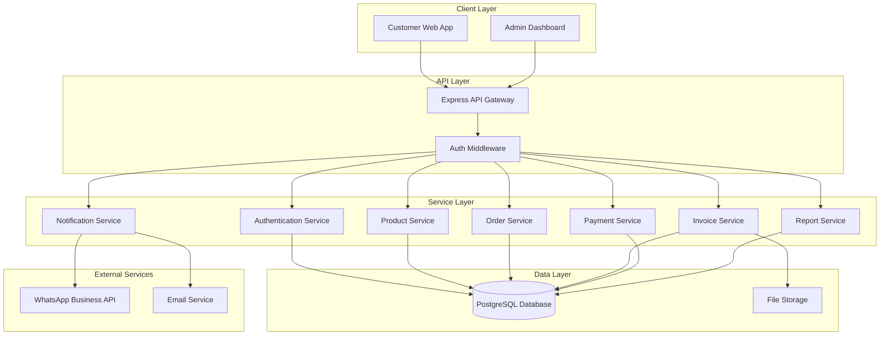
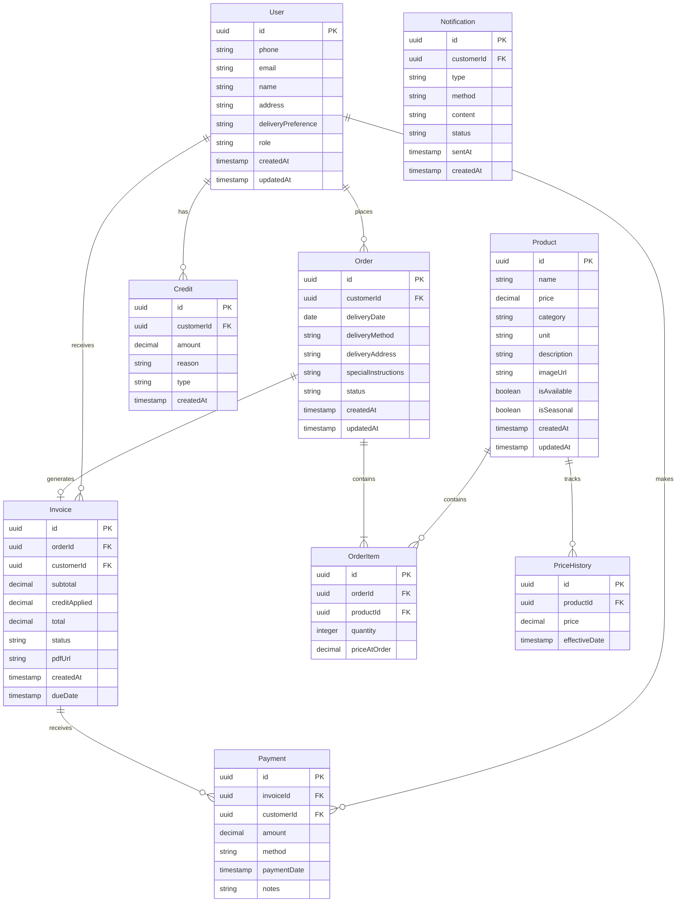

# Design Document: Organic Vegetable Order Management System

## Overview

The Organic Vegetable Order Management System is a full-stack web application designed to streamline operations for a small organic produce business. The system provides two primary interfaces: a customer-facing mobile-responsive web app for placing orders, and an admin dashboard for the business owner to manage products, process orders, generate invoices, and track payments.

### Technology Stack

**Frontend:**

- React with TypeScript for type safety
- Tailwind CSS for responsive styling
- React Router for navigation
- React Query for server state management
- Zustand for client state management

**Backend:**

- Node.js with Express.js
- TypeScript for type safety
- PostgreSQL for relational data storage
- Prisma ORM for database access
- JWT for authentication

**External Integrations:**

- WhatsApp Business API for notifications
- Email service (SendGrid or similar) for email notifications
- PDF generation library (PDFKit or Puppeteer) for invoices and packing lists

**Deployment:**

- Docker containers for consistent deployment
- Cloud hosting (AWS, DigitalOcean, or similar)

## Architecture

### System Architecture Diagram



### Architecture Patterns

1. **Layered Architecture**: Clear separation between presentation, business logic, and data access layers
2. **Service-Oriented**: Business logic encapsulated in service classes for reusability
3. **Repository Pattern**: Data access abstracted through repository interfaces
4. **RESTful API**: Standard HTTP methods and status codes for API endpoints

## Components and Interfaces

### 1. Authentication Service

**Responsibilities:**

- Handle customer and admin authentication
- Generate and validate verification codes
- Manage JWT tokens and sessions
- Send verification codes via WhatsApp/Email

**Key Methods:**

```typescript
interface AuthService {
  sendVerificationCode(contact: string, method: 'whatsapp' | 'email'): Promise<void>;
  verifyCode(contact: string, code: string): Promise<AuthToken>;
  validateToken(token: string): Promise<User>;
  refreshToken(refreshToken: string): Promise<AuthToken>;
}
```

**API Endpoints:**

- `POST /api/auth/send-code` - Send verification code
- `POST /api/auth/verify-code` - Verify code and get token
- `POST /api/auth/refresh` - Refresh access token
- `POST /api/auth/logout` - Invalidate token

### 2. Product Service

**Responsibilities:**

- Manage product catalog (CRUD operations)
- Handle product availability and seasonal flags
- Generate WhatsApp-formatted product lists
- Track pricing history

**Key Methods:**

```typescript
interface ProductService {
  createProduct(data: CreateProductDto): Promise<Product>;
  updateProduct(id: string, data: UpdateProductDto): Promise<Product>;
  deleteProduct(id: string): Promise<void>;
  getAvailableProducts(): Promise<Product[]>;
  generateProductList(): Promise<string>;
  getPricingHistory(productId: string): Promise<PriceHistory[]>;
}
```

**API Endpoints:**

- `GET /api/products` - List all products (with filters)
- `GET /api/products/:id` - Get product details
- `POST /api/products` - Create product (admin only)
- `PUT /api/products/:id` - Update product (admin only)
- `DELETE /api/products/:id` - Delete product (admin only)
- `GET /api/products/list/whatsapp` - Get WhatsApp-formatted list (admin only)

### 3. Order Service

**Responsibilities:**

- Handle customer order placement
- Validate orders against product availability
- Manage order status lifecycle
- Generate bulk orders for suppliers
- Track order history

**Key Methods:**

```typescript
interface OrderService {
  createOrder(customerId: string, data: CreateOrderDto): Promise<Order>;
  getOrder(id: string): Promise<Order>;
  getCustomerOrders(customerId: string): Promise<Order[]>;
  updateOrderStatus(id: string, status: OrderStatus): Promise<Order>;
  generateBulkOrder(weekStartDate: Date): Promise<BulkOrder>;
  getOrdersByDeliveryDate(date: Date): Promise<Order[]>;
}
```

**API Endpoints:**

- `POST /api/orders` - Create new order
- `GET /api/orders/:id` - Get order details
- `GET /api/orders/customer/:customerId` - Get customer orders
- `GET /api/orders/delivery/:date` - Get orders by delivery date (admin only)
- `POST /api/orders/bulk` - Generate bulk order (admin only)
- `PATCH /api/orders/:id/status` - Update order status (admin only)

### 4. Invoice Service

**Responsibilities:**

- Generate invoices from orders
- Apply credit balances automatically
- Generate PDF invoices
- Track invoice payment status

**Key Methods:**

```typescript
interface InvoiceService {
  generateInvoice(orderId: string): Promise<Invoice>;
  getInvoice(id: string): Promise<Invoice>;
  generateInvoicePDF(invoiceId: string): Promise<Buffer>;
  applyCredit(invoiceId: string): Promise<Invoice>;
  getCustomerInvoices(customerId: string): Promise<Invoice[]>;
}
```

**API Endpoints:**

- `POST /api/invoices/generate/:orderId` - Generate invoice from order
- `GET /api/invoices/:id` - Get invoice details
- `GET /api/invoices/:id/pdf` - Download invoice PDF
- `GET /api/invoices/customer/:customerId` - Get customer invoices

### 5. Payment Service

**Responsibilities:**

- Record payments across multiple methods
- Associate payments with invoices
- Manage customer credit balances
- Track payment history
- Handle overpayments and short delivery credits

**Key Methods:**

```typescript
interface PaymentService {
  recordPayment(data: RecordPaymentDto): Promise<Payment>;
  getPayment(id: string): Promise<Payment>;
  getCustomerPayments(customerId: string): Promise<Payment[]>;
  getCreditBalance(customerId: string): Promise<number>;
  recordShortDelivery(data: ShortDeliveryDto): Promise<Credit>;
  applyCredit(customerId: string, amount: number): Promise<void>;
}
```

**API Endpoints:**

- `POST /api/payments` - Record payment (admin only)
- `GET /api/payments/:id` - Get payment details
- `GET /api/payments/customer/:customerId` - Get customer payments
- `GET /api/credits/customer/:customerId` - Get customer credit balance
- `POST /api/credits/short-delivery` - Record short delivery credit (admin only)

### 6. Notification Service

**Responsibilities:**

- Send WhatsApp messages
- Send emails
- Queue and retry failed notifications
- Log notification history

**Key Methods:**

```typescript
interface NotificationService {
  sendWhatsApp(phone: string, message: string): Promise<void>;
  sendEmail(email: string, subject: string, body: string): Promise<void>;
  sendPaymentReminder(customerId: string): Promise<void>;
  sendOrderConfirmation(orderId: string): Promise<void>;
  sendProductList(recipients: string[]): Promise<void>;
}
```

**API Endpoints:**

- `POST /api/notifications/whatsapp` - Send WhatsApp message (admin only)
- `POST /api/notifications/email` - Send email (admin only)
- `POST /api/notifications/payment-reminder/:customerId` - Send payment reminder (admin only)
- `POST /api/notifications/product-list` - Send product list to all customers (admin only)

### 7. Report Service

**Responsibilities:**

- Generate sales reports
- Generate payment status reports
- Generate product popularity reports
- Generate customer activity reports
- Support date range filtering

**Key Methods:**

```typescript
interface ReportService {
  generateSalesReport(startDate: Date, endDate: Date): Promise<SalesReport>;
  generatePaymentStatusReport(): Promise<PaymentStatusReport>;
  generateProductPopularityReport(startDate: Date, endDate: Date): Promise<ProductPopularityReport>;
  generateCustomerActivityReport(startDate: Date, endDate: Date): Promise<CustomerActivityReport>;
}
```

**API Endpoints:**

- `GET /api/reports/sales` - Get sales report (admin only)
- `GET /api/reports/payments` - Get payment status report (admin only)
- `GET /api/reports/products` - Get product popularity report (admin only)
- `GET /api/reports/customers` - Get customer activity report (admin only)

### 8. Packing List Service

**Responsibilities:**

- Generate packing lists from orders
- Group by delivery date
- Sort by route or customer name
- Generate printable PDFs

**Key Methods:**

```typescript
interface PackingListService {
  generatePackingList(orderId: string): Promise<PackingList>;
  generatePackingListsByDate(date: Date, sortBy: 'route' | 'name'): Promise<PackingList[]>;
  generatePackingListPDF(packingListIds: string[]): Promise<Buffer>;
}
```

**API Endpoints:**

- `GET /api/packing-lists/order/:orderId` - Get packing list for order
- `GET /api/packing-lists/date/:date` - Get packing lists by delivery date
- `POST /api/packing-lists/pdf` - Generate PDF for multiple packing lists

## Data Models

### Database Schema



### TypeScript Interfaces

```typescript
// Core Domain Models

interface User {
  id: string;
  phone: string | null;
  email: string | null;
  name: string;
  address: string | null;
  deliveryPreference: 'delivery' | 'collection';
  role: 'customer' | 'admin';
  createdAt: Date;
  updatedAt: Date;
}

interface Product {
  id: string;
  name: string;
  price: number;
  category: 'vegetables' | 'fruits' | 'dairy_eggs' | 'bread_bakery' | 'pantry' | 'meat_protein';
  unit: 'kg' | 'g' | 'L' | 'ml' | 'dozen' | 'loaf' | 'pack' | 'piece';
  description: string | null;
  imageUrl: string | null;
  isAvailable: boolean;
  isSeasonal: boolean;
  createdAt: Date;
  updatedAt: Date;
}

interface Order {
  id: string;
  customerId: string;
  customer?: User;
  deliveryDate: Date;
  deliveryMethod: 'delivery' | 'collection';
  deliveryAddress: string | null;
  specialInstructions: string | null;
  status: 'pending' | 'confirmed' | 'packed' | 'delivered' | 'cancelled';
  items: OrderItem[];
  createdAt: Date;
  updatedAt: Date;
}

interface OrderItem {
  id: string;
  orderId: string;
  productId: string;
  product?: Product;
  quantity: number;
  priceAtOrder: number;
}

interface Invoice {
  id: string;
  orderId: string;
  order?: Order;
  customerId: string;
  customer?: User;
  subtotal: number;
  creditApplied: number;
  total: number;
  status: 'unpaid' | 'partial' | 'paid';
  pdfUrl: string | null;
  createdAt: Date;
  dueDate: Date;
}

interface Payment {
  id: string;
  invoiceId: string;
  invoice?: Invoice;
  customerId: string;
  customer?: User;
  amount: number;
  method: 'cash' | 'yoco' | 'eft';
  paymentDate: Date;
  notes: string | null;
}

interface Credit {
  id: string;
  customerId: string;
  customer?: User;
  amount: number;
  reason: string;
  type: 'overpayment' | 'short_delivery' | 'refund';
  createdAt: Date;
}

interface PriceHistory {
  id: string;
  productId: string;
  product?: Product;
  price: number;
  effectiveDate: Date;
}

interface Notification {
  id: string;
  customerId: string;
  customer?: User;
  type: 'order_confirmation' | 'payment_reminder' | 'product_list';
  method: 'whatsapp' | 'email';
  content: string;
  status: 'pending' | 'sent' | 'failed';
  sentAt: Date | null;
  createdAt: Date;
}

// DTOs (Data Transfer Objects)

interface CreateProductDto {
  name: string;
  price: number;
  category: 'vegetables' | 'fruits' | 'dairy_eggs' | 'bread_bakery' | 'pantry' | 'meat_protein';
  unit: 'kg' | 'g' | 'L' | 'ml' | 'dozen' | 'loaf' | 'pack' | 'piece';
  description?: string;
  imageUrl?: string;
  isAvailable: boolean;
  isSeasonal: boolean;
}

interface UpdateProductDto {
  name?: string;
  price?: number;
  category?: 'vegetables' | 'fruits' | 'dairy_eggs' | 'bread_bakery' | 'pantry' | 'meat_protein';
  unit?: 'kg' | 'g' | 'L' | 'ml' | 'dozen' | 'loaf' | 'pack' | 'piece';
  description?: string;
  imageUrl?: string;
  isAvailable?: boolean;
  isSeasonal?: boolean;
}

interface CreateOrderDto {
  deliveryDate: Date;
  deliveryMethod: 'delivery' | 'collection';
  deliveryAddress?: string;
  specialInstructions?: string;
  items: {
    productId: string;
    quantity: number;
  }[];
}

interface RecordPaymentDto {
  invoiceId: string;
  customerId: string;
  amount: number;
  method: 'cash' | 'yoco' | 'eft';
  paymentDate: Date;
  notes?: string;
}

interface ShortDeliveryDto {
  orderId: string;
  customerId: string;
  items: {
    productId: string;
    quantityShort: number;
  }[];
}

// Report Models

interface SalesReport {
  startDate: Date;
  endDate: Date;
  totalRevenue: number;
  totalOrders: number;
  productsSold: {
    productId: string;
    productName: string;
    quantitySold: number;
    revenue: number;
  }[];
}

interface PaymentStatusReport {
  totalOutstanding: number;
  customers: {
    customerId: string;
    customerName: string;
    outstandingBalance: number;
    lastPaymentDate: Date | null;
  }[];
}

interface ProductPopularityReport {
  startDate: Date;
  endDate: Date;
  products: {
    productId: string;
    productName: string;
    orderCount: number;
    totalQuantity: number;
    revenue: number;
  }[];
}

interface CustomerActivityReport {
  startDate: Date;
  endDate: Date;
  customers: {
    customerId: string;
    customerName: string;
    orderCount: number;
    totalSpent: number;
    averageOrderValue: number;
    lastOrderDate: Date | null;
  }[];
}

interface BulkOrder {
  weekStartDate: Date;
  items: {
    productId: string;
    productName: string;
    totalQuantity: number;
    bufferQuantity: number;
    finalQuantity: number;
    contributingOrders: string[];
  }[];
  generatedAt: Date;
}
```

## Error Handling

### Error Response Format

All API errors will follow a consistent format:

```typescript
interface ErrorResponse {
  error: {
    code: string;
    message: string;
    details?: any;
  };
}
```

### Error Categories

1. **Authentication Errors (401)**
   - Invalid or expired token
   - Invalid verification code
   - Unauthorized access

2. **Validation Errors (400)**
   - Missing required fields
   - Invalid data format
   - Business rule violations

3. **Not Found Errors (404)**
   - Resource not found
   - Invalid ID

4. **Conflict Errors (409)**
   - Duplicate resource
   - State conflict

5. **Server Errors (500)**
   - Database errors
   - External service failures
   - Unexpected errors

### Error Handling Strategy

- All service methods throw typed errors
- API layer catches errors and maps to HTTP responses
- Client displays user-friendly error messages
- All errors logged with context for debugging
- External service failures handled with retries and fallbacks

## Testing Strategy

### Unit Testing

**Coverage Target: 80%+**

- Test all service methods in isolation
- Mock external dependencies (database, APIs)
- Test edge cases and error conditions
- Use Jest as testing framework

**Key Areas:**

- Business logic in services
- Data validation
- Credit calculations
- Bulk order aggregation
- Invoice generation logic

### Integration Testing

**Coverage Target: Key workflows**

- Test API endpoints with real database (test DB)
- Test service interactions
- Test authentication flows
- Test external service integrations (with mocks)

**Key Workflows:**

- Customer order placement end-to-end
- Invoice generation with credit application
- Payment recording and credit balance updates
- Bulk order generation
- Notification sending

### End-to-End Testing

**Coverage Target: Critical user journeys**

- Use Playwright or Cypress
- Test complete user flows in browser
- Test both customer and admin interfaces

**Critical Journeys:**

- Customer login and order placement
- Admin product management
- Admin order processing and invoice generation
- Admin payment recording
- Report generation

### Manual Testing

- WhatsApp integration (requires real API)
- Email delivery
- PDF generation quality
- Print layouts for invoices and packing lists
- Mobile responsiveness

## Security Considerations

### Authentication & Authorization

- JWT tokens with short expiration (15 minutes access, 7 days refresh)
- Verification codes expire after 10 minutes
- Role-based access control (customer vs admin)
- All admin endpoints require admin role
- Customers can only access their own data

### Data Protection

- Passwords not stored (verification code only)
- Sensitive data encrypted at rest
- HTTPS required for all communications
- SQL injection prevention via Prisma ORM
- Input validation on all endpoints

### Rate Limiting

- Verification code sending: 3 per hour per contact
- API requests: 100 per minute per user
- Login attempts: 5 per hour per contact

### Audit Logging

- Log all admin actions (product changes, payment recording)
- Log authentication attempts
- Log payment transactions
- Retain logs for 90 days

## Performance Considerations

### Database Optimization

- Indexes on frequently queried fields (customerId, deliveryDate, status)
- Pagination for list endpoints (default 50 items)
- Database connection pooling
- Query optimization for reports

### Caching Strategy

- Cache product catalog (5 minute TTL)
- Cache customer credit balances (1 minute TTL)
- Cache reports (15 minute TTL)
- Use Redis for caching layer

### File Storage

- Store PDFs in cloud storage (S3 or similar)
- Generate PDFs asynchronously for large batches
- Implement PDF caching for invoices

### Scalability

- Stateless API design for horizontal scaling
- Background job queue for notifications and PDF generation
- Database read replicas for reporting queries

## Deployment Strategy

### Environment Configuration

- Development: Local PostgreSQL, mock external services
- Staging: Cloud database, real external services (test accounts)
- Production: Cloud database with backups, real external services

### CI/CD Pipeline

1. Run linting and type checking
2. Run unit tests
3. Run integration tests
4. Build Docker images
5. Deploy to staging
6. Run E2E tests on staging
7. Manual approval for production
8. Deploy to production
9. Run smoke tests

### Monitoring & Logging

- Application logs aggregated (CloudWatch, Datadog, etc.)
- Error tracking (Sentry or similar)
- Performance monitoring (response times, database queries)
- Uptime monitoring
- Alert on critical errors

### Backup Strategy

- Daily automated database backups
- Retain backups for 30 days
- Test restore process monthly
- Backup file storage separately

## Initial Product Catalog

### Product Categories and Examples

The system will be seeded with the following product categories and example products:

**Vegetables:**
- Tomatoes (kg)
- Potatoes (kg)
- Onions (kg)
- Carrots (kg)
- Lettuce (piece)
- Spinach (bunch/pack)
- Peppers (kg)
- Cucumbers (piece)

**Fruits:**
- Apples (kg)
- Bananas (kg)
- Oranges (kg)
- Grapes (kg)
- Berries (pack)

**Dairy & Eggs:**
- Milk - 1L (L)
- Milk - 2L (L)
- Eggs - 6 pack (dozen)
- Eggs - 12 pack (dozen)
- Cheese (g/pack)
- Yogurt (ml/pack)
- Butter (g)

**Bread & Bakery:**
- White Bread (loaf)
- Whole Wheat Bread (loaf)
- Sourdough (loaf)
- Rolls (pack)

**Pantry Items:**
- Olive Oil (ml)
- Honey (g/ml)
- Pasta (g/pack)
- Rice (kg)
- Flour (kg)

**Meat & Protein:**
- Chicken Breast (kg)
- Chicken Thighs (kg)
- Beef Mince (kg)
- Beef Steak (kg)

### Database Seed Script

A seed script will be created to populate the database with these initial products, including:
- Product names and categories
- Default pricing (to be updated by admin)
- Units of measure
- Availability status (all available initially)
- Seasonal flags (none initially)

## Future Enhancements

### Phase 2 Potential Features

1. **Mobile Apps**: Native iOS and Android apps for better customer experience
2. **Inventory Management**: Track actual stock levels and alert on low inventory
3. **Route Optimization**: Optimize delivery routes automatically
4. **Customer Subscriptions**: Allow recurring weekly orders
5. **Loyalty Program**: Points or discounts for frequent customers
6. **Multi-supplier Management**: Track different suppliers and their products
7. **Advanced Analytics**: Predictive ordering, demand forecasting
8. **Customer Feedback**: Ratings and reviews for products
9. **Promotional Campaigns**: Discount codes and special offers
10. **Integration with Accounting Software**: Export to Xero, QuickBooks, etc.
