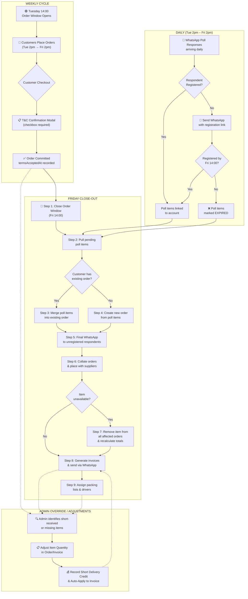
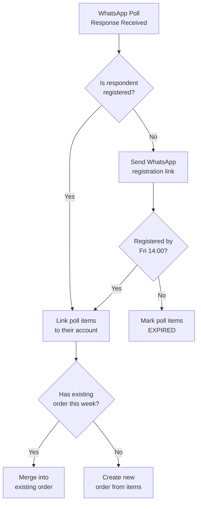

# Our Harvest Tote — Full Weekly Order Workflow

```mermaid
flowchart TD
    subgraph "WEEKLY CYCLE"
        direction TB
        A["🟢 Tuesday 14:00\nOrder Window Opens"] --> B["🛒 Customers Place Orders\n(Tue 2pm → Fri 2pm)"]
        B --> C{"Customer Checkout"}
        C --> D["📋 T&C Confirmation Modal\n(checkbox required)"]
        D --> E["✅ Order Committed\ntermsAcceptedAt recorded"]
    end

    subgraph "DAILY (Tue 2pm – Fri 2pm)"
        direction TB
        F["📱 WhatsApp Poll Responses\narriving daily"] --> G{"Respondent\nRegistered?"}
        G -- Yes --> H["Poll items linked\nto account"]
        G -- No --> I["📨 Send WhatsApp\nwith registration link"]
        I --> J{"Registered by\nFri 14:00?"}
        J -- Yes --> H
        J -- No --> K["❌ Poll items\nmarked EXPIRED"]
    end

    subgraph "ADMIN OVERRIDE / ADJUSTMENTS"
        direction LR
        W["🔍 Admin identifies short-received\nor missing items"] --> X["📋 Adjust Item Quantity\nin Order/Invoice"]
        X --> Y["💰 Record Short Delivery Credit\n& Auto-Apply to Invoice"]
    end

    subgraph "FRIDAY CLOSE-OUT"
        direction TB
        L["🔴 Step 1: Close Order Window\n(Fri 14:00)"] --> M["Step 2: Pull pending\npoll items"]
        M --> N{"Customer has\nexisting order?"}
        N -- Yes --> O["Step 3: Merge poll items\ninto existing order"]
        N -- No --> P["Step 4: Create new order\nfrom poll items"]
        O --> Q["Step 5: Final WhatsApp\nto unregistered respondents"]
        P --> Q
        Q --> R["Step 6: Collate orders\n& place with suppliers"]
        R --> S{"Item\nunavailable?"}
        S -- Yes --> T["Step 7: Remove item from\nall affected orders\n& recalculate totals"]
        S -- No --> U["Step 8: Generate invoices\n& send via WhatsApp"]
        T --> U
        U --> V["Step 9: Assign packing\nlists & drivers"]
    end

    E --> L
    H --> M
    K --> M
    
    %% Relations to the Adjustment Loop
    E -.-> W
    U -.-> W
    V -.-> W
    Y -.-> U
```

---

# Poll Items Decision Tree

```mermaid
flowchart TD
    A["WhatsApp Poll\nResponse Received"] --> B{"Is respondent\nregistered?"}
    B -- Yes --> C["Link poll items\nto their account"]
    B -- No --> D["Send WhatsApp\nregistration link"]
    D --> E{"Registered by\nFri 14:00?"}
    E -- Yes --> C
    E -- No --> F["Mark poll items\nEXPIRED"]
    C --> G{"Has existing\norder this week?"}
    G -- Yes --> H["Merge into\nexisting order"]
    G -- No --> I["Create new\norder from items"]
```
